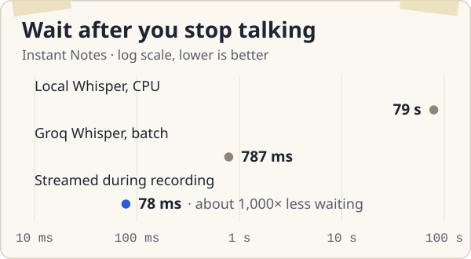
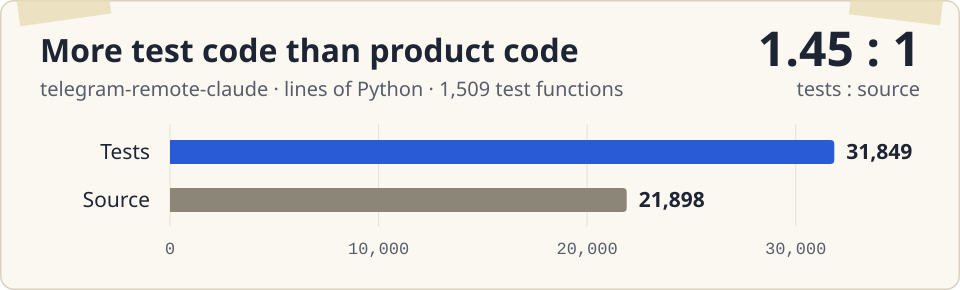

<picture>
  <source media="(prefers-color-scheme: dark)" srcset="assets/cover-dark.svg">
  
</picture>

I'm finishing an M.S. in Artificial Intelligence at Northeastern University (Khoury College, Roux Institute) in December 2026, and I'm looking for ML and AI engineering roles that start in January 2027. You can reach me at [pratap.b@northeastern.edu](mailto:pratap.b@northeastern.edu) or on [LinkedIn](https://www.linkedin.com/in/bhanu-pratap24).

This page works like my lab notebook. Each project gets an entry with the question I started from, what I tried, and what I measured. The numbers come first, and the charts link to where they came from.

## Contents

| No. | Project | Headline |
|:--|:--|:--|
| [01](#user-content-exp-01--instant-notes) | Hotkey voice notes for macOS | Wait after you stop talking: 79&nbsp;s to 78&nbsp;ms |
| [02](#user-content-exp-02--claude-code-from-a-phone) | Claude Code from a phone, over Telegram | 1,509 tests, more test code than source |
| [03](#user-content-exp-03--readmission-risk-at-abacus-health) | Hospitalization and readmission risk (internship) | A 16-way resampling experiment, validation kept clean |
| [04](#user-content-exp-04--fraud-at-0172) | Credit-card fraud at 0.172% positives | AUPRC above 0.90 |
| [05](#user-content-exp-05--animal-re-identification) | Telling individual animals apart | Recall@K and mAP on an unseen species |
| [06](#user-content-exp-06--a-pipeline-for-coding-agents) | An approval-gated pipeline for coding agents | 10 skills, used every day |

Also in here: [on the bench](#user-content-on-the-bench) · [field notes](#user-content-field-notes) · [methods I trust](#user-content-methods-i-trust) · [timeline](#user-content-timeline) · [currently curious about](#user-content-currently-curious-about)

## Entries

### EXP-01 · Instant Notes

2026 · Python, SQLite FTS5, faster-whisper, Groq, Deepgram, Sarvam · [bhutanibhanu/instant-notes](https://github.com/bhutanibhanu/instant-notes)

**Question.** Can a hotkey voice note on a Mac feel instant when the speech is Hinglish, with Hindi and English mixed in the same sentence?

<b>Method</b>

- One speech-to-text interface with four backends behind it: faster-whisper running locally, Groq Whisper, Deepgram nova-3, and Sarvam. I benchmarked them head to head on word error rate, latency, and cost per run.
- Twelve tuning loops on a 132-second code-switched clip, covering romanized output, prompt A/B tests, silence trimming, model choice, and parallel chunking.
- Audio goes to the backend in roughly 8-second windows while you are still recording, so when you stop, only the last window is left. The raw text shows up right away, and an LLM cleanup pass replaces it about 1.5 s later.
- Notes live in SQLite with FTS5 search. Spoken queries are routed by rules, and only summaries and open questions go to an LLM.

**Result.**

<picture>
  <source media="(prefers-color-scheme: dark)" srcset="assets/exp01-latency-dark.svg">
  
</picture>

Fig. 1. Source: <a href="https://github.com/bhutanibhanu/instant-notes/blob/main/docs/benchmarks/tuning-summary.md">docs/benchmarks/tuning-summary.md</a> in the repo.

- The wait after you stop talking went from **79&nbsp;s to 78&nbsp;ms**.
- Word error rate went from **0.99 to between 0.26 and 0.30**. The cleanup pass alone takes Groq's raw output from 0.43 to 0.30.
- It needs one API key instead of four, and it ships with 63 tests, three ADRs, and CI.

**Note to self.** Moving from local Whisper to Groq got the wait under a second. The next 10× came from not waiting for the stop at all: by then at most the last 8 seconds of audio are left to transcribe.

### EXP-02 · Claude Code from a phone

2026 · Python, Claude Agent SDK, asyncio, python-telegram-bot · [bhutanibhanu/telegram-remote-claude](https://github.com/bhutanibhanu/telegram-remote-claude)

**Question.** Can I run a coding agent on my Mac from my phone and approve its tool calls with a tap, without handing a chat window the keys to my machine?

<b>Method</b>

- Telegram is only the transport. Behind it are two interchangeable engines, a one-shot `claude -p` runner and a streaming Agent SDK session, and a single environment variable picks between them.
- Tool-approval prompts stream back into the chat as buttons.
- The security model has a chat allowlist, filesystem path confinement, and a bash command policy. Audit records leave out message and file contents on purpose.
- Sessions persist, several projects can run at once, and a scheduler can start work on its own.

**Result.**

<picture>
  <source media="(prefers-color-scheme: dark)" srcset="assets/exp02-tests-dark.svg">
  
</picture>

Fig. 2. Line counts of the Python source and <a href="https://github.com/bhutanibhanu/telegram-remote-claude/tree/main/tests">tests</a>.

- **1,509 test functions** across 278 commits, with 31,849 lines of tests against 21,898 lines of source.

**Note to self.** I built this with an AI coding agent. The architecture and the security model were my calls, and so was what the tests had to prove. The test suite is how I checked that the agent built what I meant.

### EXP-03 · Readmission risk at Abacus Health

Machine Learning Intern, Sep to Dec 2025 · Python, SQL Server, scikit-learn, TabNet · client work, so no public repo

**Question.** Which members of a health insurer's diabetes-prevention program are likely to be hospitalized or readmitted, and are the scores trustworthy enough to rank a triage list?

<b>Method</b>

- Built a model-ready dataset from multi-year claims: utilization, clinical labs, comorbidities, cost, adherence, and medication complexity.
- Ran a 16-way resampling experiment (random oversampling, Borderline-, KMeans- and IHT-SMOTE, ADASYN, SMOTEENN). The validation split stayed unresampled, so a gain had to come from the model and not from the sampler.
- Compared logistic regression baselines with random forests, tree ensembles, and TabNet, then calibrated the probabilities and tuned the thresholds.
- Investigated the source data in SQL Server (member identifiers, hospital admissions per 1,000 members by base year) to scope a utilization analysis the CTO asked for, covering 2019 through 2023.

**Result.**

- Raw risk scores became a calibrated, thresholded triage list.
- I found a CSV round-trip defect that had been silently corrupting feature ranges in every resampling run. Storage moved to Parquet, with audit and data-quality checks so it can't happen quietly again.
- I presented the method, its limits, and the next steps to the CTO in a 20-minute readout, along with a written handoff.

**Note to self.** The finding that mattered most was a file-format bug. Before running a 16-way comparison, check that the data going into it is the data you think it is.

### EXP-04 · Fraud at 0.172%

Python, XGBoost, PyTorch

**Question.** In about 285,000 card transactions where 0.172% are fraud, what does a good model even look like?

<b>Method</b>

- AUPRC is the headline metric, not accuracy. A classifier that calls everything legitimate scores 99.8% accuracy on this data and catches nothing.
- SMOTE, GAN-generated synthetic fraud cases, and hybrid resampling for the minority class.
- XGBoost against neural models including an LSTM, with decision thresholds tuned on the precision/recall trade-off, because that trade-off decides how many cases a person has to review.

**Result.**

- **AUPRC above 0.90**, and **recall up 28%** over the baseline.

**Note to self.** If I had reported accuracy, this project would have looked finished on day one.

### EXP-05 · Animal re-identification

Northeastern CS 5330 · PyTorch, timm

**Question.** Can learned embeddings tell individual lynx, salamanders, and sea turtles apart, including animals from a species the model never saw in training?

<b>Method</b>

- An image-retrieval pipeline with five configurations across ResNet-50, EfficientNet-B4, and a MegaDescriptor baseline, trained with ArcFace and hard-triplet losses.
- One species held out entirely to test generalization.
- Retrieval scored with Recall@K and mAP. Embeddings clustered with HDBSCAN and K-Means and scored by ARI, NMI, and purity.

**Result.**

- All five configurations compared on Recall@K and mAP, with the unseen species as the hard test.
- An augmentation ablation measured how color changes and texture changes each affect identity matching.
- Open-set rejection analyzed with similarity thresholds and FAR/FRR curves, which is what lets the system say "I haven't seen this animal" instead of forcing a match.

**Note to self.** A held-out species tells you whether the embedding learned identity or just memorized the animals it trained on.

### EXP-06 · A pipeline for coding agents

2026 · Claude Code skills · [bhutanibhanu/prompts](https://github.com/bhutanibhanu/prompts)

**Question.** How do I let coding agents do the tedious parts of a feature without losing track of what gets merged?

<b>Method</b>

- Ten Claude Code skills (`grill`, `plan`, `build`, `ship`, `pipeline`, `adr`, `scaffold`, `triage`, `checkpoint`, `resume`) that chain into one flow: scope, plan, supervised build, verify, ship.
- `/pipeline` reads the current phase from a state file in the repo instead of guessing it, and can give each feature its own git worktree.
- In the build loop a subagent implements one task at a time, and nothing is committed until I approve the diff. Before shipping, an isolated reviewer subagent and a second model (Codex) both review the branch.

**Result.**

- I use it every day across my projects. This page went through it too: a design doc, a task plan, a review by an isolated subagent and another by Codex, then a pull request.

**Note to self.** Agents write code fast and are bad at knowing when to stop. The approval steps exist for that.

## On the bench

- **[clipping-tool](https://github.com/bhutanibhanu/clipping-tool)** turns one creator's long-form video into captioned 9:16 clips on the Mac. Transcription runs locally, Claude picks the strongest moments, and every clip gets approved by hand. Ingest, local transcription, and moment detection are in. Rendering, review, and export come next, once an eval of detection quality passes.

**Side note.** [monitor-volume-remote](https://github.com/bhutanibhanu/monitor-volume-remote) sets my external monitor's speaker volume from my phone over Wi-Fi, using DDC/CI through `m1ddc` on Apple Silicon.

## Field notes

Things the entries above taught me, mostly the hard way:

1. Resample the training split and leave validation alone, or you end up measuring the sampler. ([EXP-03](#user-content-exp-03--readmission-risk-at-abacus-health))
2. On imbalanced data accuracy flatters you. At 0.172% positives, never flagging anything scores 99.8%. ([EXP-04](#user-content-exp-04--fraud-at-0172))
3. A CSV round-trip can quietly change your features. I keep data in Parquet now and run data-quality checks on load. ([EXP-03](#user-content-exp-03--readmission-risk-at-abacus-health))
4. Once the model is fast, look for work you can start earlier. Streaming got Instant Notes its last 10×. ([EXP-01](#user-content-exp-01--instant-notes))
5. When an agent writes the code, the tests are the spec. ([EXP-02](#user-content-exp-02--claude-code-from-a-phone))

## Methods I trust

| Area | Tools | Used in |
|:--|:--|:--|
| Evaluation | AUPRC, Recall@K, mAP, WER, probability calibration, FAR/FRR | [01](#user-content-exp-01--instant-notes) · [03](#user-content-exp-03--readmission-risk-at-abacus-health) · [04](#user-content-exp-04--fraud-at-0172) · [05](#user-content-exp-05--animal-re-identification) |
| Modeling | PyTorch, scikit-learn, XGBoost, timm, TabNet | [03](#user-content-exp-03--readmission-risk-at-abacus-health) · [04](#user-content-exp-04--fraud-at-0172) · [05](#user-content-exp-05--animal-re-identification) |
| Metric learning | ArcFace, triplet loss, HDBSCAN, K-Means | [05](#user-content-exp-05--animal-re-identification) |
| LLMs and agents | Claude Agent SDK, tool use, prompt design, LLM routing and cleanup | [01](#user-content-exp-01--instant-notes) · [02](#user-content-exp-02--claude-code-from-a-phone) · [06](#user-content-exp-06--a-pipeline-for-coding-agents) |
| Speech | faster-whisper, Groq Whisper, Deepgram, Sarvam | [01](#user-content-exp-01--instant-notes) |
| Data | Python, SQL, SQL Server, SQLite FTS5, Parquet | [01](#user-content-exp-01--instant-notes) · [03](#user-content-exp-03--readmission-risk-at-abacus-health) |
| Engineering | Git, CI, pytest, ADRs | [01](#user-content-exp-01--instant-notes) · [02](#user-content-exp-02--claude-code-from-a-phone) · [06](#user-content-exp-06--a-pipeline-for-coding-agents) |
| Also | FAISS, RAG, fine-tuning, Hugging Face, PostgreSQL, FastAPI, Node.js, React, Docker, C++ | |

## Timeline

| When | What |
|:--|:--|
| Dec 2026 | M.S. Artificial Intelligence, Northeastern University, Khoury College of Computer Sciences (Roux Institute), expected |
| Sep to Dec 2025 | Machine Learning Intern, Abacus Health Solutions ([EXP-03](#user-content-exp-03--readmission-risk-at-abacus-health)) |
| 2024 | First place, Pine Tree Hackathon Challenge, Roux Institute |
| 2023 to 2024 | Associate Software Developer, Poetistic. REST APIs and full-stack features in Node.js, React, and MongoDB, plus content pipelines and recommendation work |
| 2023 | B.Tech Computer Science and Engineering, Kurukshetra University |

## Currently curious about

- How to evaluate LLM agents on real tasks instead of demos.
- Calibration: when a model says 0.8, is it right 80% of the time?
- Speech recognition for people who switch languages mid-sentence.

---

If you're hiring for ML or AI engineering in 2027, I'd like to hear from you: <a href="mailto:pratap.b@northeastern.edu">pratap.b@northeastern.edu</a> · <a href="https://www.linkedin.com/in/bhanu-pratap24">LinkedIn</a>. The charts on this page are generated by <code>scripts/build_assets.py</code> in <a href="https://github.com/bhutanibhanu/bhutanibhanu">this repo</a>.
